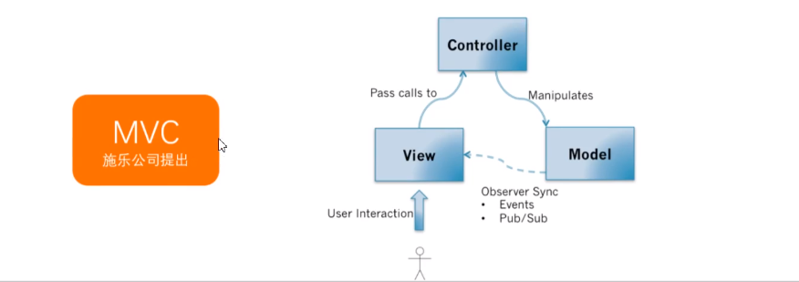
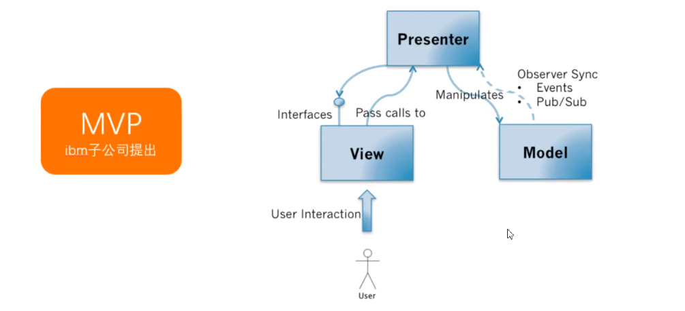
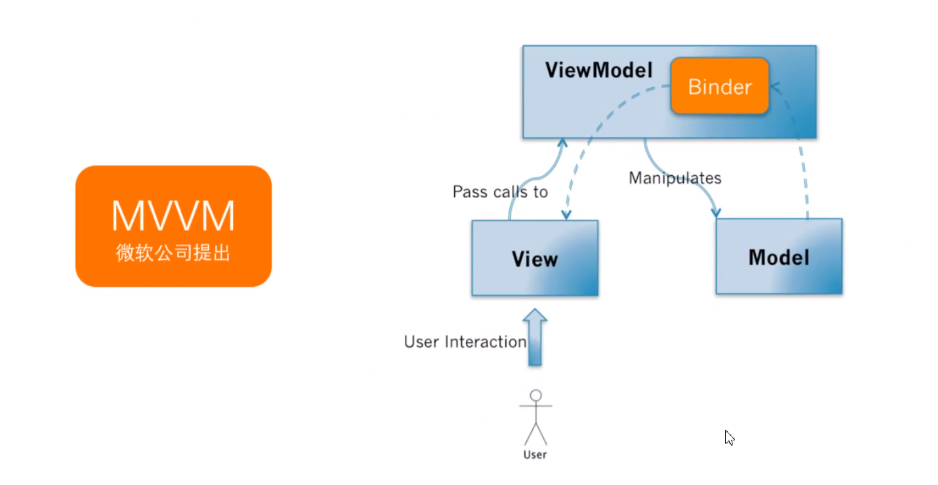

# MVC/MVP/MVVM

## MVC 模式

1. “MVC”：module view  controller

    - 用户对View操作以后，View捕获到这个操作，会把处理的权利交移Controller (Pass calls) ; 

    - Controller会对来自View数据进行预处理、 决定调用哪个Model的接口;

    - 然后由Model执行相关的业务逻辑(数据请求) ;
      当Model变更了以后,会通过观察者模式(Observer Pattern)通知View;

    - View通过观察者模式收到Model变更的消息以后，会向Model请求最新的数据，然后重新更新界面。

2. 把业务逻辑和展示逻辑分离，模块化程度高。但由于View是强依赖特定的Model的，所以View无法组件化，无法复用 

## MVP
1. "MVP":module view presenter
	- 和MVC模式一样,用户对View的操作都会从View交移给Presenter。
	- Presenter会执行相应的应用程序逻辑，并且对Model进行相应的操作;
	- 而这时候Model执行完业务逻辑以后,也是通过观察者模式把自己变更的消息传递出去，但是是传给Presenter而不是View。Presenter获取到Model变更的消息以后，通过View提供的接口更新界面。
	- View不依赖Model, View可以进行组件化。但Model  ->  View的手动同步逻辑比较麻烦，维护困难

## MVVM
1. "MVVM": module view viewmodule
	- MVVM的调用关系和MVP一样。
	- 但是，在ViewModel当中会有一-个叫Binder,或者是Data-binding engine的东西。你只需要在View的模版语法当中，指令式地声明View.上的显示的内容是和Model的哪一块数据绑定的。
	- 当ViewModel对进行Model更新的时候，Binder会 自动把数据更新到View上去，当用户对View进行操作(例如表单输入)，Binder也会自动把数据更新到Model.上去。这种方式称为: Two-way data-binding,双向数据绑定。可以简单而不恰当地理解为一个模版引擎,但是会根据数据变更实时渲染。
	- 解决了MVP大量的手动View和Model同步的问题，提供双向绑定机制。提高了代码的可维护性。
	- 对于大型的图形应用程序，视图状态较多。
	- ViewModel的构建和维护的成本都会比较高。
